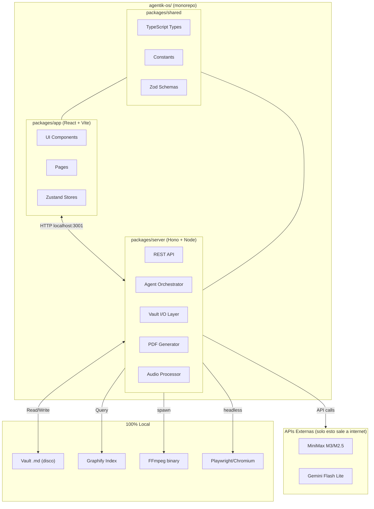
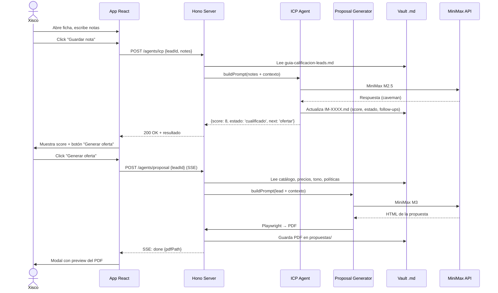
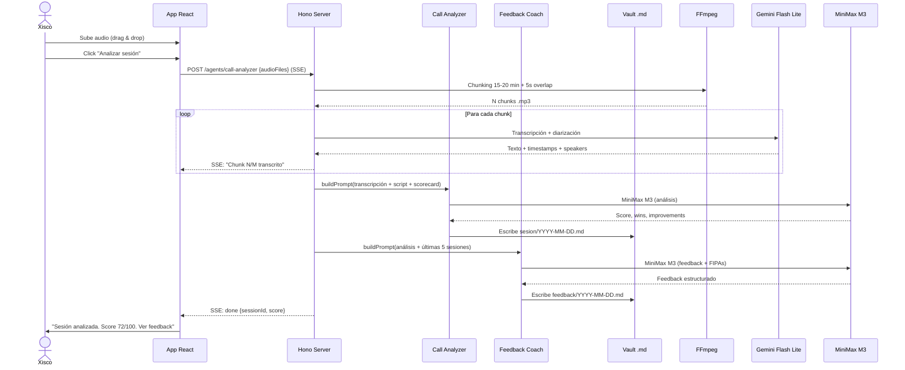
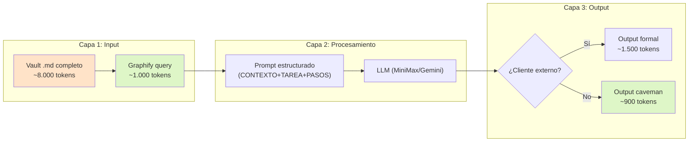

# Análisis Técnico Completo — Agentik O.S.

> **Tipo:** Análisis puro. No se programa ni se modifica nada.  
> **Perspectiva:** Ingeniero senior (+10 años) evaluando el proyecto  
> **Documentos analizados:** Todos los archivos del vault (7 en `00-Sistema/`, 5 raíz, contenido de `01-IronMonkeyCharter/`, `MEMORY.md`)  
> **Fecha:** 13 junio 2026

---

## 0. Finalidad y propósito real del proyecto

Antes de entrar en lo técnico, necesito dejar claro **para qué existe esto**, porque eso condiciona toda decisión arquitectónica.

### ¿Qué es Agentik O.S.?

Es un **centro de operaciones personal para un comercial freelancer** (Xisco) que gestiona dos negocios simultáneamente. No es un SaaS, no es un producto para vender, no es un backoffice corporativo. Es una herramienta **para una sola persona** que necesita:

1. **Dejar de perder leads** por no hacer follow-up a tiempo (Iron Monkey)
2. **Mejorar sus skills de venta** mediante feedback objetivo de sus llamadas (Growing)
3. **No perder tiempo** en tareas que un sistema puede hacer por él (generar PDFs, calcular KPIs, recordar follow-ups)

### ¿Por qué importa esto para la arquitectura?

Porque un sistema para 1 usuario no necesita:
- Autenticación / autorización
- Multi-tenancy
- Escalabilidad horizontal
- CDN / cache distribuida
- CI/CD complejo

Pero **sí necesita**:
- **Fiabilidad extrema** (si se rompe, Xisco pierde leads)
- **Velocidad de desarrollo** (Xisco no va a esperar 6 meses)
- **Simplicidad de mantenimiento** (no hay equipo de DevOps)
- **Bajo coste operativo** (~62 EUR/mes máximo)

> [!IMPORTANT]
> Toda decisión técnica que tome debe pasar este filtro: **¿esto ayuda a Xisco a cerrar más o a perder menos tiempo?** Si no, es sobreingeniería.

---

## 1. Evaluación de la planificación existente (00-Sistema)

He leído los 7 documentos de `00-Sistema/`. Esta es mi evaluación archivo por archivo:

### 1.1 Tabla de evaluación

| Documento | Calidad | Completitud | Problemas detectados |
|-----------|---------|-------------|---------------------|
| [app-arquitectura.md](file:///c:/Users/xisco/OneDrive/Escritorio/GERVASI/Agentik-OS-Vault/00-Sistema/app-arquitectura.md) | ⭐⭐⭐⭐⭐ | 95% | Excelente. Estructura de carpetas, tipos TS, flujos de uso, wireframes ASCII. Es el documento más completo del vault. |
| [stack-tecnico.md](file:///c:/Users/xisco/OneDrive/Escritorio/GERVASI/Agentik-OS-Vault/00-Sistema/stack-tecnico.md) | ⭐⭐⭐⭐ | 85% | Sólido. Correcta eliminación de LLMLingua2. Falta definir versiones exactas de dependencias. |
| [orquestacion.md](file:///c:/Users/xisco/OneDrive/Escritorio/GERVASI/Agentik-OS-Vault/00-Sistema/orquestacion.md) | ⭐⭐⭐⭐⭐ | 90% | Resuelve bien el gap que detecté en el primer análisis. Patrón request/response claro. |
| [reglas-prompts.md](file:///c:/Users/xisco/OneDrive/Escritorio/GERVASI/Agentik-OS-Vault/00-Sistema/reglas-prompts.md) | ⭐⭐⭐⭐ | 80% | Buenas plantillas. Falta: manejo de errores en prompts, retry logic, token budget por agente. |
| [dashboards.md](file:///c:/Users/xisco/OneDrive/Escritorio/GERVASI/Agentik-OS-Vault/00-Sistema/dashboards.md) | ⭐⭐⭐⭐⭐ | 95% | Impresionante nivel de detalle. Wireframes, colores, data sources — listo para implementar. |
| [metricas-objetivos.md](file:///c:/Users/xisco/OneDrive/Escritorio/GERVASI/Agentik-OS-Vault/00-Sistema/metricas-objetivos.md) | ⭐⭐⭐⭐ | 85% | KPIs bien definidos. Falta: baseline actual (¿cuál es el score promedio HOY?) para medir progreso real. |
| [calendario-ejecucion.md](file:///c:/Users/xisco/OneDrive/Escritorio/GERVASI/Agentik-OS-Vault/00-Sistema/calendario-ejecucion.md) | ❌ | 0% | **Vacío.** Este archivo debería tener el calendario de cadencias (08:00, 18:00, domingo) que ya está documentado en `orquestacion.md`. Redundancia o descuido. |

### 1.2 Veredicto de la planificación

> [!TIP]
> **La planificación está en un 85-90% de madurez.** Es inusualmente buena para un proyecto personal — tiene wireframes, tipos TypeScript, flujos de uso con ASCII art, y un nivel de detalle que muchos equipos profesionales no alcanzan. Los problemas son menores y se resuelven durante la implementación.

---

## 2. Inconsistencias detectadas entre documentos

Estas son las contradicciones que **deben resolverse antes de programar**:

| # | Inconsistencia | Dónde aparece | Impacto |
|---|---------------|---------------|---------|
| 1 | `index.md` dice "LLMLingua2 5x por defecto" (línea 24, 109) pero `stack-tecnico.md` y `SOUL.md` dicen que está eliminado en v1 | [index.md](file:///c:/Users/xisco/OneDrive/Escritorio/GERVASI/Agentik-OS-Vault/index.md) L24, L109 vs [stack-tecnico.md](file:///c:/Users/xisco/OneDrive/Escritorio/GERVASI/Agentik-OS-Vault/00-Sistema/stack-tecnico.md) L24-27 | 🔴 Confunde a cualquier agente que lea `index.md` primero |
| 2 | `orquestacion.md` sección 3.2 dice "Pseudo-endpoints (el worker es local, no HTTP real)" pero `app-arquitectura.md` describe un "Worker Node.js + Express en localhost:3001" con endpoints HTTP reales | [orquestacion.md](file:///c:/Users/xisco/OneDrive/Escritorio/GERVASI/Agentik-OS-Vault/00-Sistema/orquestacion.md) L147-148 vs [app-arquitectura.md](file:///c:/Users/xisco/OneDrive/Escritorio/GERVASI/Agentik-OS-Vault/00-Sistema/app-arquitectura.md) L54-58 | 🟡 Decisión de diseño no cerrada |
| 3 | `orquestacion.md` sección 3.1 describe un patrón request/response basado en archivos `.md` en `/requests/` y `/responses/`, pero la `app-arquitectura.md` no menciona estas carpetas en la estructura de carpetas del vault | [orquestacion.md](file:///c:/Users/xisco/OneDrive/Escritorio/GERVASI/Agentik-OS-Vault/00-Sistema/orquestacion.md) L131-143 | 🟡 Modelo de comunicación mixto (archivos vs HTTP) |
| 4 | Existen DOS carpetas Iron Monkey: `01-IronMonkey/` (vacía del scaffold original) y `01-IronMonkeyCharter/` (con datos reales) | Filesystem | 🔴 Los agentes no sabrán cuál consultar |
| 5 | `calendario-ejecucion.md` está vacío, pero sus responsabilidades ya están cubiertas por `orquestacion.md` sección 2.3 | [calendario-ejecucion.md](file:///c:/Users/xisco/OneDrive/Escritorio/GERVASI/Agentik-OS-Vault/00-Sistema/calendario-ejecucion.md) | 🟢 Eliminar o rellenar con referencia |
| 6 | `orquestacion.md` L165 y `dashboards.md` L305 tienen caracteres corruptos (Chinese characters `积en`, `考虑`, `替换`) — restos de un modelo multilingüe | Varios archivos | 🟡 Cosmético pero desorienta |

---

## 3. Arquitectura Backend — Mi recomendación técnica

### 3.1 Decisión: Monorepo con monolito local

Para un proyecto de 1 usuario que corre en localhost, **un monorepo con un backend monolítico** es la opción correcta. No necesitamos microservicios, no necesitamos Docker, no necesitamos Kubernetes.



### 3.2 ¿Por qué Hono y no Express?

| Criterio | Express | Hono | Veredicto |
|----------|---------|------|-----------|
| TypeScript nativo | ❌ Requiere `@types/express` | ✅ First-class | Hono |
| Performance | Aceptable | 3-5x más rápido en routing | Hono |
| Tamaño | ~60 KB | ~14 KB | Hono |
| Validación integrada | No (necesitas middleware) | Sí (zod + hono/validator) | Hono |
| Ecosistema maduro | ✅ Enorme | ⚠️ Creciente | Express |
| Compatibilidad con Node.js | ✅ Nativo | ✅ Desde v4+ | Empate |

**Mi recomendación:** Hono. Para un backend local de 7 endpoints, la simplicidad y el TypeScript nativo de Hono es más valioso que el ecosistema de Express. No necesitamos Passport.js, no necesitamos session middleware, no necesitamos nada de lo que justifica Express.

> [!NOTE]
> Si prefieres Express por familiaridad, el cambio es trivial. La arquitectura no cambia, solo el framework HTTP.

### 3.3 Estructura de carpetas del backend

```
packages/server/
├── src/
│   ├── index.ts                    # Entry point, Hono app
│   ├── routes/
│   │   ├── agents.ts               # POST /agents/:name/run
│   │   ├── vault.ts                # GET/POST /vault/:path
│   │   ├── leads.ts                # CRUD /leads
│   │   ├── sessions.ts             # CRUD /sessions
│   │   └── digest.ts               # GET /digest/:type
│   │
│   ├── agents/                     # Lógica de cada agente
│   │   ├── base-agent.ts           # Clase abstracta: run(), buildPrompt()
│   │   ├── icp.agent.ts
│   │   ├── proposal.agent.ts
│   │   ├── crm-manager.agent.ts
│   │   ├── call-analyzer.agent.ts
│   │   ├── feedback-coach.agent.ts
│   │   ├── prospect-notes.agent.ts
│   │   └── goal-tracker.agent.ts
│   │
│   ├── services/                   # Servicios reutilizables
│   │   ├── vault.service.ts        # Lee/escribe .md con frontmatter
│   │   ├── minimax.service.ts      # Cliente HTTP para M3/M2.5
│   │   ├── gemini.service.ts       # Cliente HTTP para Flash Lite
│   │   ├── graphify.service.ts     # Wrapper para queries al grafo
│   │   ├── pdf.service.ts          # Playwright → HTML → PDF
│   │   ├── audio.service.ts        # FFmpeg chunking
│   │   └── digest.service.ts       # Genera digests
│   │
│   ├── middleware/
│   │   ├── logger.ts               # Log de cada request → log.md
│   │   └── error-handler.ts        # Centralizado, sin crashes
│   │
│   └── config/
│       ├── paths.ts                # Rutas absolutas al vault
│       ├── models.ts               # API keys, endpoints, timeouts
│       └── prompts.ts              # Plantillas de prompts por agente
│
├── package.json
└── tsconfig.json
```

### 3.4 Patrón de comunicación: HTTP, no archivos

> [!IMPORTANT]
> **Recomiendo descartar el patrón request/response basado en archivos** descrito en `orquestacion.md` sección 3.1. Es innecesariamente complejo para una app local.

**¿Por qué?** El patrón de archivos introduce:
- Polling (la app tiene que comprobar si hay un nuevo archivo de response)
- Serialización/deserialización manual
- Estado "zombie" si un response nunca llega
- Debugging difícil (hay que inspeccionar archivos en disco)

**Alternativa recomendada:** HTTP simple con SSE (Server-Sent Events) para tareas largas:

```
App React                  Hono Server
    │                          │
    ├── POST /agents/icp ──────┤
    │   {leadId, notes}        │
    │                          ├── Lee vault
    │                          ├── Consulta Graphify
    │                          ├── Llama a MiniMax M2.5
    │                          ├── Escribe en vault
    │   ◄── 200 {result} ─────┤
    │                          │
    ├── POST /agents/proposal ─┤   (tarea larga ~30s)
    │                          ├── SSE: "Consultando catálogo..."
    │   ◄── SSE event ─────────┤
    │                          ├── SSE: "Generando HTML..."
    │   ◄── SSE event ─────────┤
    │                          ├── SSE: "Creando PDF..."
    │   ◄── SSE event ─────────┤
    │   ◄── SSE: done {pdfPath}┤
```

- Para tareas rápidas (ICP, CRM update, goal tracker): HTTP request/response normal.
- Para tareas largas (Proposal Generator, Call Analyzer): SSE para progreso en tiempo real.

### 3.5 Vault I/O — La pieza más crítica del backend

El vault es la base de datos. El `vault.service.ts` es el equivalente a un ORM:

```typescript
// Pseudo-código del servicio de vault
interface VaultService {
  // Lectura
  readLead(id: string): Promise<Lead>;
  listLeads(filters?: LeadFilters): Promise<Lead[]>;
  readSession(date: string): Promise<Sesion>;
  
  // Escritura
  writeLead(lead: Lead): Promise<void>;  // → .md con frontmatter
  updateLeadField(id: string, field: string, value: any): Promise<void>;
  writeSession(session: Sesion): Promise<void>;
  writeFeedback(feedback: Feedback): Promise<void>;
  
  // Utilidades
  appendToLog(entry: LogEntry): Promise<void>;
  getDigestData(type: 'ironmonkey' | 'growing'): Promise<DigestData>;
}
```

**Librería para frontmatter:** `gray-matter` (estable, probada) o `gray-matter-es` (ESM nativo, mejor TypeScript). Para un proyecto con Vite (ESM), recomiendo `gray-matter-es`.

**Rendimiento:** Con ~200 archivos `.md` máximo, no necesitas base de datos. Un `readdir` + `gray-matter` parse tarda < 50ms incluso en Windows. Si crece a 1.000+ leads, entonces añades un índice SQLite.

### 3.6 Dependencias del backend a nivel de sistema

| Dependencia | Uso | Instalación | Peso |
|-------------|-----|-------------|------|
| **Node.js ≥ 20** | Runtime | Ya instalado | — |
| **FFmpeg** | Chunking de audio | `winget install ffmpeg` o descarga manual | ~90 MB |
| **Playwright Chromium** | HTML → PDF | `npx playwright install chromium` | ~200 MB |
| **Python 3.x** | Solo para Graphify | Probablemente ya instalado | — |

> [!WARNING]
> FFmpeg y Playwright Chromium suman ~290 MB de binarios locales. Es un one-time download, pero hay que documentarlo en el setup.

---

## 4. Arquitectura Frontend — Mi recomendación técnica

### 4.1 Decisión: La planificación actual está bien

La arquitectura frontend propuesta en [app-arquitectura.md](file:///c:/Users/xisco/OneDrive/Escritorio/GERVASI/Agentik-OS-Vault/00-Sistema/app-arquitectura.md) es **excelente**. No la cambiaría significativamente. Mis ajustes son menores:

### 4.2 Stack frontend definitivo

| Capa | Elección | Justificación |
|------|----------|---------------|
| **Build** | Vite 6+ | HMR rápido, TypeScript first-class |
| **Framework** | React 19 | Hooks, Suspense, concurrent features |
| **Lenguaje** | TypeScript strict | Obligatorio para datos tipados del vault |
| **Estilos** | TailwindCSS 4 + shadcn/ui | Componentes accesibles, diseño rápido |
| **Estado global** | Zustand 5 | Sin boilerplate, perfecto para 1 usuario |
| **Routing** | React Router 7 (framework mode OFF) | SPA simple, sin SSR |
| **Charts** | Recharts 2 | Cubre line, bar, funnel, gauge |
| **Drag & drop** | dnd-kit | Pipeline de columnas |
| **Formularios** | react-hook-form + zod | Validación tipada |
| **Markdown** | react-markdown + remark-gfm | Preview de notas |
| **PDF viewer** | react-pdf | Previsualización de propuestas |
| **Grafo** | react-force-graph-2d | Visualización de la memoria |
| **Fechas** | date-fns | Ligero, tree-shakeable |
| **Iconos** | lucide-react | Coherente con shadcn |
| **Notificaciones** | Web Notifications API | Push local |
| **HTTP client** | ky o fetch nativo | Llamadas al backend local |

### 4.3 Lo que cambiaría vs. la planificación actual

| Punto | Planificación actual | Mi recomendación | Por qué |
|-------|---------------------|------------------|---------|
| **HTTP client** | No especificado | `ky` (wrapper moderno de fetch) | Type-safe, retry integrado, SSE support |
| **Audio upload** | Drag & drop genérico | react-dropzone + progress bar | Archivos de 100+ MB necesitan feedback visual |
| **Tema oscuro** | No mencionado | Dark mode por defecto + toggle | Xisco trabaja muchas horas — dark mode reduce fatiga |
| **PWA offline** | Descartado en v1 | Añadir Service Worker mínimo en v1 | No para offline, sino para las Web Notifications |
| **Error boundaries** | No mencionados | React Error Boundary en cada sección | Si el dashboard falla, el CRM sigue funcionando |
| **Virtualización** | No mencionada | `@tanstack/react-virtual` para lista de llamadas | Si una sesión tiene 100+ llamadas, el DOM se ahoga |
| **Skeleton loading** | No mencionado | shadcn Skeleton durante cargas del backend | UX premium, evita flashes de contenido vacío |

### 4.4 Estructura de carpetas del frontend (refinada)

Mantengo la propuesta de `app-arquitectura.md` con estos ajustes:

```
packages/app/
├── src/
│   ├── main.tsx
│   ├── App.tsx
│   ├── routes.tsx
│   │
│   ├── components/
│   │   ├── ui/                         # shadcn primitives (Button, Card, etc.)
│   │   ├── layout/
│   │   │   ├── AppShell.tsx            # Layout principal: sidebar + topbar + content
│   │   │   ├── Sidebar.tsx
│   │   │   ├── Topbar.tsx
│   │   │   └── DigestBanner.tsx
│   │   ├── ironmonkey/
│   │   │   ├── Pipeline.tsx            # ← Este es el componente estrella
│   │   │   ├── LeadCard.tsx
│   │   │   ├── LeadForm.tsx
│   │   │   ├── LeadDetail.tsx          # ← NUEVO: panel lateral de detalle
│   │   │   ├── NoteEditor.tsx          # ← NUEVO: editor de notas con "Guardar + ICP"
│   │   │   ├── ProposalModal.tsx
│   │   │   └── AlertList.tsx
│   │   ├── growing/
│   │   │   ├── SessionList.tsx
│   │   │   ├── SessionDetail.tsx
│   │   │   ├── AudioUploader.tsx
│   │   │   ├── CallTimeline.tsx        # ← NUEVO: timeline visual de llamadas
│   │   │   ├── FipaCards.tsx           # ← NUEVO: tarjetas FIPA del digest
│   │   │   ├── GamificationPanel.tsx
│   │   │   └── ScoreRadar.tsx          # ← NUEVO: radar chart de las 5 dimensiones
│   │   ├── dashboard/
│   │   │   ├── KpiCards.tsx
│   │   │   ├── TrendLine.tsx
│   │   │   ├── FunnelChart.tsx
│   │   │   ├── AlertList.tsx
│   │   │   └── ComparisonTable.tsx
│   │   └── shared/
│   │       ├── ErrorBoundary.tsx        # ← NUEVO
│   │       ├── SkeletonLoader.tsx       # ← NUEVO
│   │       ├── ConfirmDialog.tsx        # ← NUEVO: "¿Seguro? Esto tarda ~30s"
│   │       └── EmptyState.tsx           # ← NUEVO: estados vacíos bonitos
│   │
│   ├── pages/
│   │   ├── Home.tsx
│   │   ├── IronMonkey.tsx
│   │   ├── Growing.tsx
│   │   ├── Dashboard.tsx
│   │   ├── Memory.tsx
│   │   └── Settings.tsx
│   │
│   ├── hooks/                          # ← NUEVO
│   │   ├── useAgent.ts                 # Hook para llamar a un agente con loading/error
│   │   ├── useDigest.ts                # Hook para obtener y cachear el digest
│   │   ├── useKeyboard.ts             # Hook para atajos de teclado
│   │   └── useNotification.ts         # Hook para Web Notifications
│   │
│   ├── lib/
│   │   ├── api/                        # ← Renombrado de "agents/"
│   │   │   ├── client.ts              # Instancia de ky configurada
│   │   │   ├── agents.api.ts          # Funciones: runIcp(), generateProposal()...
│   │   │   ├── vault.api.ts           # Funciones: getLead(), listSessions()...
│   │   │   └── digest.api.ts
│   │   └── utils/
│   │       ├── date.ts
│   │       ├── format.ts
│   │       └── id.ts
│   │
│   ├── stores/
│   │   ├── pipelineStore.ts
│   │   ├── sessionStore.ts
│   │   ├── goalStore.ts
│   │   ├── digestStore.ts
│   │   └── uiStore.ts                  # ← NUEVO: sidebar abierta, tema, modal activo
│   │
│   └── types/                          # Se mueve a packages/shared/
│
├── public/
│   └── sw.js                           # Service Worker para notificaciones
├── package.json
├── tsconfig.json
├── vite.config.ts
└── tailwind.config.ts
```

---

## 5. Sistema de orquestación de agentes

### 5.1 Patrón de agente base

Todos los agentes comparten una estructura común. Esto se implementa como una clase abstracta:

```
BaseAgent
  ├── name: string
  ├── model: 'minimax-m3' | 'minimax-m2.5' | 'gemini-flash'
  ├── outputMode: 'caveman' | 'formal'
  ├── maxTokensBudget: number          ← NUEVO: budget por agente
  │
  ├── buildContext(): string           ← Graphify queries
  ├── buildPrompt(input): string       ← Plantilla de reglas-prompts.md
  ├── execute(input): Promise<Result>  ← Llama al modelo
  ├── validate(result): boolean        ← Verifica que el output sea coherente
  ├── persist(result): Promise<void>   ← Escribe en el vault
  └── log(action): Promise<void>       ← Registra en log.md
```

### 5.2 Flujos de orquestación

#### Iron Monkey: Flujo principal



#### Growing: Flujo principal



### 5.3 Token budget por agente

Esto **falta** en la planificación actual y es fundamental para controlar costes:

| Agente | Modelo | Input max | Output max | Coste estimado/ejecución |
|--------|--------|-----------|------------|--------------------------|
| ICP | M2.5 | 2.000 tokens | 500 tokens | ~$0.0004 |
| Proposal Generator | M3 | 8.000 tokens | 3.000 tokens | ~$0.006 |
| CRM Manager | M2.5 | 3.000 tokens | 800 tokens | ~$0.001 |
| Call Analyzer (análisis) | M3 | 15.000 tokens | 2.000 tokens | ~$0.007 |
| Call Analyzer (transcripción) | Gemini Flash | ~25 min audio | ~5.000 tokens | ~$0.002 |
| Feedback Coach | M3 | 10.000 tokens | 2.000 tokens | ~$0.004 |
| Prospect Notes | M2.5 | 2.000 tokens | 500 tokens | ~$0.0004 |
| Goal Tracker | M2.5 | 3.000 tokens | 800 tokens | ~$0.001 |

**Coste diario estimado (máximo):**
- Iron Monkey: ~5 leads/día × (ICP + posible Proposal) ≈ $0.03/día
- Growing: 1 sesión/día × (Call Analyzer + Feedback) ≈ $0.01/día
- Digests: 2/día × $0.001 ≈ $0.002/día
- **Total: ~$0.04/día → ~$1.20/mes** en tokens de pago-por-uso

> [!TIP]
> El plan de MiniMax de 50 EUR/mes te da **mucho más** de lo que necesitas. Con el volumen estimado, podrías usar el plan de 20 EUR/mes y aún sobrar. Recomiendo empezar con el plan menor y subir si es necesario.

---

## 6. Skills por agente — Recomendación detallada

### 6.1 Skills ya instaladas

| Skill | Estado | Útil para |
|-------|--------|-----------|
| **mmx-cli** | ✅ Instalada | Llamadas a MiniMax desde terminal/agentes |
| **Caveman** | ⚠️ Pendiente | Compresión de output en todos los agentes |
| **Graphify** | ⚠️ Pendiente | Contexto optimizado del vault |

### 6.2 Skills adicionales recomendadas (GitHub)

| Skill | Repo | Qué hace | Para qué agente | Prioridad |
|-------|------|----------|-----------------|-----------|
| **taskmaster-ai** | `eyaltoledano/claude-task-master` | Descompone tareas complejas en subtareas, tracking de progreso | Orquestador general — para desglosar las fases de implementación | ⭐⭐⭐ Alta |
| **code-review** | Skill nativa de Antigravity | Revisa código generado antes de commitear | Dev workflow — para cuando estéis programando la app | ⭐⭐⭐ Alta |
| **sequential-thinking** | MCP server nativo | Pensamiento paso a paso para tareas complejas | Proposal Generator, Feedback Coach — para razonamiento de calidad | ⭐⭐ Media |

### 6.3 Skills custom a crear (con el creador de skills)

Para las tareas más específicas de Agentik O.S., recomiendo crear skills custom:

| Skill custom | Propósito | Contenido del SKILL.md |
|--------------|-----------|------------------------|
| **`agentik-lead-qualifier`** | Estandarizar cómo el ICP evalúa leads | Plantilla de prompt, scorecard, reglas de output caveman, ejemplos |
| **`agentik-pdf-proposal`** | Estandarizar generación de propuestas | Template HTML, reglas de tono, datos obligatorios, checklist de validación |
| **`agentik-call-scorer`** | Estandarizar análisis de llamadas | Los 32 criterios del COL-Analyser v3.1, pesos, errores fatales, formato output |
| **`agentik-fipa-generator`** | Estandarizar generación de FIPAs | Reglas: máximo 5, accionable, con timestamp, formato del digest |
| **`agentik-digest`** | Estandarizar los digests 08:00 y 18:00 | Formato, datos obligatorios, priorización de alertas |

> [!TIP]
> Cada skill custom es simplemente un `SKILL.md` que describe el comportamiento esperado. No es código — es contexto estructurado. Lo creas una vez y todos los agentes lo reutilizan.

---

## 7. Sistema de ahorro de tokens — Recomendación definitiva

### 7.1 Arquitectura de ahorro en 3 capas (v1)



### 7.2 Estrategias concretas que implementar

| Estrategia | Ahorro | Complejidad | Implementar en |
|------------|--------|-------------|----------------|
| **Graphify para contexto** | 5-10x input | Media | Fase 1 |
| **Caveman para output interno** | 1.4-1.6x output | Baja (solo prompt) | Fase 1 |
| **Token budget por agente** | Previene descontrol | Baja | Fase 1 |
| **Prompt caching** (hash del prompt → si ya se ejecutó, reusar respuesta) | Variable, alto para digests repetitivos | Media | Fase 2 |
| **Batch processing** de chunks de audio (enviar todos juntos a Gemini) | Reduce overhead HTTP | Baja | Fase 2 |
| **Incremental indexing** de Graphify (solo re-indexar archivos modificados) | Reduce tiempo de indexación | Media | Fase 3 |

### 7.3 Lo que NO implementar en v1

| Herramienta | Por qué no |
|-------------|-----------|
| **LLMLingua2** | Modelo ML de 1.3 GB, integración manual, beneficio marginal con Graphify ya activo |
| **Prompt chaining con modelos pequeños** | Sobreingeniería para 7 agentes simples |
| **Embedding cache con vector DB** | El vault es demasiado pequeño para justificar Pinecone/Weaviate |

---

## 8. Decisiones de diseño abiertas

Estas son las preguntas que necesitan respuesta antes de programar:

### 8.1 ¿Backend Python o Node.js?

| Aspecto | Python | Node.js (TS) |
|---------|--------|--------------|
| Graphify | ✅ Nativo (pip) | ❌ Necesita subprocess |
| MiniMax API | ✅ requests/httpx | ✅ fetch/ky |
| Gemini API | ✅ SDK oficial | ✅ SDK oficial |
| FFmpeg | ⚠️ subprocess | ⚠️ fluent-ffmpeg |
| Playwright PDF | ✅ Nativo | ✅ Nativo |
| Frontend compartido (tipos) | ❌ Dos lenguajes | ✅ Monorepo TS |
| Conocimiento del equipo | ⚠️ Depende | ✅ Todo en TS |

**Mi recomendación:** Node.js + TypeScript. La ventaja de tener **un solo lenguaje** para frontend y backend (tipos compartidos, monorepo, un solo `package.json` de dev) supera la conveniencia de Graphify nativo en Python. Graphify se puede llamar como subprocess o via HTTP si tiene server mode.

### 8.2 ¿Web local o Tauri?

**Fase 1:** Web local (`localhost:5173` frontend + `localhost:3001` backend). Cero fricción de setup.

**Fase 2+ (si Xisco quiere):** Empaquetar con Tauri 2. Ventajas:
- App nativa con icono en taskbar
- Acceso directo al filesystem (sin File System Access API)
- Notificaciones nativas del SO
- ~5 MB de bundle (vs ~200 MB de Electron)

### 8.3 ¿Cómo integrar Graphify en Node.js?

Tres opciones:

| Opción | Complejidad | Rendimiento |
|--------|------------|-------------|
| **A. Subprocess Python** (`child_process.exec('python -m graphifyy query "..."')`) | Baja | Lento (~2-3s por query, cold start de Python) |
| **B. HTTP wrapper** (un mini Flask/FastAPI que expose Graphify como API) | Media | Medio (~500ms warm, ~2s cold) |
| **C. Pre-indexar y leer el JSON del grafo directamente en Node.js** | Alta (parsing custom) | Rápido (~50ms) |

**Recomendación:** Opción B para empezar (simple, funciona), migrar a C en v2 si la latencia es problema.

---

## 9. Roadmap técnico priorizado

### Fase 0 — Preparación (2-3 días)

- [ ] Resolver inconsistencias del vault (sección 2 de este documento)
- [ ] Eliminar `01-IronMonkey/` vacío, dejar solo `01-IronMonkeyCharter/`
- [ ] Actualizar `index.md` (eliminar referencias a LLMLingua2)
- [ ] Rellenar o eliminar `calendario-ejecucion.md`
- [ ] Limpiar caracteres corruptos en `orquestacion.md` y `dashboards.md`
- [ ] Instalar Graphify (`pip install graphifyy`) y hacer primer indexado del vault
- [ ] Instalar Caveman skill (`npx skills add juliusbrussee/caveman`)
- [ ] Instalar FFmpeg (`winget install ffmpeg`)
- [ ] Instalar Playwright Chromium (`npx playwright install chromium`)

### Fase 1 — Esqueleto funcional (1 semana)

- [ ] Crear monorepo: `packages/app`, `packages/server`, `packages/shared`
- [ ] Backend Hono: 3 endpoints básicos (health, list-leads, get-lead)
- [ ] Vault service: lectura de `.md` con frontmatter
- [ ] Frontend Vite + React + Tailwind + shadcn
- [ ] Layout principal (AppShell + Sidebar + Topbar)
- [ ] Pipeline Iron Monkey (columnas drag & drop, datos del vault)
- [ ] Tipos TypeScript compartidos en `packages/shared`

### Fase 2 — Escritura + primer agente (1 semana)

- [ ] LeadForm: crear y editar leads (escribe en vault)
- [ ] NoteEditor: textarea + botón "Guardar nota"
- [ ] ICP Agent: primer agente conectado a MiniMax M2.5
- [ ] Integración Graphify (subprocess wrapper)
- [ ] Resultado del ICP visible en la app (score, estado, follow-ups)
- [ ] Log de acciones en `log.md`

### Fase 3 — Inteligencia completa (1-2 semanas)

- [ ] Proposal Generator: Graphify → MiniMax M3 → HTML → Playwright → PDF
- [ ] ProposalModal: preview del PDF en la app
- [ ] AudioUploader: subida + chunking con FFmpeg
- [ ] Call Analyzer: Gemini transcripción + MiniMax análisis
- [ ] Feedback Coach: feedback estructurado + FIPAs
- [ ] SessionDetail: vista de sesión con score, wins, improvements
- [ ] Goal Tracker: KPIs + racha + gamificación

### Fase 4 — Polish + digests (1 semana)

- [ ] Digest 08:00 Iron Monkey (pipeline + alertas + acciones)
- [ ] Digest 08:00 Growing (FIPAs del día anterior)
- [ ] Service Worker para Web Notifications
- [ ] Dashboard con charts (Recharts)
- [ ] Memory Graph (react-force-graph-2d)
- [ ] Dark mode
- [ ] Atajos de teclado
- [ ] Error boundaries
- [ ] Estados vacíos y skeleton loading
- [ ] Testing manual end-to-end

---

## 10. Resumen ejecutivo

| Dimensión | Estado actual | Mi veredicto |
|-----------|--------------|-------------|
| **Planificación** | 85-90% completa | Inusualmente madura. Hay que limpiar inconsistencias y empezar. |
| **Backend** | Bien diseñado conceptualmente | Usar Hono + Node.js TS. HTTP real, no archivos request/response. |
| **Frontend** | Excelente diseño de componentes | Ejecutar tal cual con los ajustes menores listados. |
| **Agentes** | 7 bien definidos con triggers claros | Añadir token budget y clase base abstracta. |
| **Skills** | Caveman + Graphify + mmx-cli | Crear 5 skills custom para estandarizar las tareas de cada agente. |
| **Tokens** | Graphify + Caveman = 10-20x ahorro | Suficiente para v1. No añadir LLMLingua2. |
| **Orquestación** | Casi resuelta | HTTP + SSE > archivos. Cadencias al abrir la app. |
| **Coste** | ~62 EUR/mes estimado | Probablemente sobrestimado. ~20-30 EUR/mes es más realista. |
| **Riesgo principal** | Scope creep | 4 fases claras. No saltar de fase. |
| **Tiempo estimado** | 4 semanas a buen ritmo | Realista si se dedican 3-4h/día al desarrollo. |

> [!IMPORTANT]
> **El proyecto es sólido. La planificación es muy buena. El mayor riesgo no es técnico — es intentar hacer todo a la vez.** Fase 1 debe funcionar antes de pensar en Fase 2. Un pipeline drag & drop que lee del vault ya es valioso por sí solo.
